# Romaji2Kana API <!-- omit in toc -->

## Table of Contents <!-- omit in toc -->

- [1. Installations, Dependencies, Build \& Deployment](#1-installations-dependencies-build--deployment)
  - [1.1. Installations](#11-installations)
  - [1.2. Dependencies](#12-dependencies)
  - [1.3. Build](#13-build)
  - [1.4. Deployment](#14-deployment)
- [2. Cloud Infrastructure](#2-cloud-infrastructure)
  - [2.1. Amazon Route 53](#21-amazon-route-53)
  - [2.2 Amazon CloudFront](#22-amazon-cloudfront)
  - [2.3. AWS Certificate Manager](#23-aws-certificate-manager)
  - [2.4. Amazon API Gateway](#24-amazon-api-gateway)
  - [2.5. AWS Lambda](#25-aws-lambda)
  - [2.6. Amazon CloudWatch](#26-amazon-cloudwatch)
- [3. Code](#3-code)
  - [3.1. `main` and `release` branch](#31-main-and-release-branch)
  - [3.2. `main` branch](#32-main-branch)
  - [3.3. `release` branch](#33-release-branch)
- [4. API Tests](#4-api-tests)
  - [4.1. Japanese sample words and phrases](#41-japanese-sample-words-and-phrases)
- [5. API Documentation](#5-api-documentation)
- [6. Miscellaneous Notes](#6-miscellaneous-notes)
  - [6.1. Possible values of "queryStringParameters" in event given to Lambda](#61-possible-values-of-querystringparameters-in-event-given-to-lambda)

<br>

## 1. Installations, Dependencies, Build & Deployment

### 1.1. Installations

The Romaji2Kana API project only requires Javascript Runtime `Node.js 18 (LTS)` to be installed. On my local computer I use [Node v18.12.1](https://nodejs.org/de/blog/release/v18.12.0) and on AWS the Runtime *Node.js 18.x* is selected.

For testing the API the `Postman` API Platform is used, which can be [installed](https://www.postman.com/downloads/) (recommended) or used in the web version.

<br>

### 1.2. Dependencies

The dependencies are managed via the `npm` package manager, that comes with Node.js. They can be installed by running the command `npm install`. And listed via `npm list`.

- [wanakana@5.1.0](https://github.com/WaniKani/WanaKana): a JavaScript library for detecting and transliterating Hiragana, Katakana and Romaji in all directions

On top of that, *the local development version* of the API (lying in this `main` branch) additionally has a server framework installed to serve the API.

> See [3. Code Structure](#3-code-structure) for a comparison between the local development and the deployed Cloud version (`main` vs. `release` branch).

- [express@4.18.2](https://github.com/expressjs/express): a fast, unopinionated, minimalist web framework for Node.js

Keep the dependencies up to date:

- run `npm outdated`. This will check every installed dependency and compare the current version with the latest version in the npm registry and print results in a nice table.
- check the changeslogs of the respective dependencies for breaking changes
- run `npm update` to update the

To update to a new major version (which often has breaking changes), you need to run `npm install <package>@latest` manually. See [How to Update NPM Dependencies](https://www.freecodecamp.org/news/how-to-update-npm-dependencies/) by [freecodecamp.org](https://www.freecodecamp.org/).

<br>

### 1.3. Build

> Execute the following commands in the working directory of the project.

For the local development version in `main` branch:

1. Install all the dependencies with `npm install`.
2. Serve the app with `node .` (takes default entrypoint `index.js`) or `node index.js`.
3. Test it by running requests against it, e.g. http://localhost:3000/v1/is/japanese?q=わたし should return `{"result":true}`

For the cloud deployment version in `release` branch:

1. Install all the dependencies with `npm install`.

<br>

### 1.4. Deployment

> To deploy the production version, switch to the `release` branch.

Deploy the API to the cloud into production:

- automatically: run `npm run deploy` (to understand see `script` section of `package.json`)
- manually: make a ZIP file of the whole working directory and upload it as code to the Lambda function `romaji2kana-api` via the AWS Management Console

> **Important:** from here we can only change behaviour of the Lambda function. If we'd like to change major things about the API, like adding or removing endpoints, we'd have to go to API Gateway Management Console and edit it there! Mind the whole infrastructure, see [2. Cloud Infrastructure](#2-cloud-infrastructure).

<br>

## 2. Cloud Infrastructure

The following diagram shows the cloud infrastructure of the API in AWS.


The explanation follows one chapter at a time.

<br>

### 2.1. Amazon Route 53

Here are two records:

- an A record pointing the subdomain `api.romaji2kana.com` to the cloudfront distribution's domain name `d29lm7o1eb303u.cloudfront.net`
- a CNAME record `....api.romaji2kana.com` pointing to `....acm-validations.aws`: proves to the Certificate Manager that we own the domain

<br>

### 2.2 Amazon CloudFront

This CloudFront distribution (of our API positioned behind it) is almost invisible to us as a user. It has been created and is being fully managed for us by AWS, because we chose "edge-optimized" as API endpoint type instead of "regional".

We get to see the endpoint however, because we ourselves needed to create a DNS A record of `api.romaji2kana.com` to point this distribution's endpoint, as said in [2.1. Amazon Route 53](#21-amazon-route-53).

> Look the distribution domain name up:<br>
> API Gateway > Custom domain nnames > `api.romaji2kana.com` > Configurations > API Gateway domain name: `d29lm7o1eb303u.cloudfront.net`

<br>

### 2.3. AWS Certificate Manager

The API implements TLS (SSL) encryption, by using a certificate from AWS Certificate Manager. It shares this certificate with the Romaji2Kana website (I added both `romaji2kana.com` and `api.romaji2kana.com` domain names to this certificate).

The Cloudfront distribution uses this certificate. I configured this in API Gateway, because - as mentioned - we get the distribution fully managed there.

> Look the certificate configuration up:<br>
> API Gateway > Custom domain nnames > `api.romaji2kana.com` > Configurations > ACM certificate ARN: `arn:aws:acm:us-east-1:617879802663:certificate/34342583-9219-4ff8-b211-5ab260410f3e`

<br>

### 2.4. Amazon API Gateway

This API Gateway is of the type REST API type, [because we want to keep the possibility open to monetize the API in the future, which requires features such as API keys, Per-client rate limiting, usage plans etc. - therefor HTTP API type is not enough](https://docs.aws.amazon.com/apigateway/latest/developerguide/http-api-vs-rest.html).

The API endpoint type is "Edge" (which deployed our API to CloudFront, serving it via the CDN!). This makes it significantly faster just like the also CloudFront delivered Romaji2Kana website.

The only API Stage is `prod`. The domain name `api.romaji2kana.com` is configured to be map to this stage (see API Gateway > Custom domain names > `api.romaji2kana.com` > API mappings).

Visiting the API Management Console > `romaji2kana-api` > Resources, you see the full resource tree. Only the leaves of the tree are configured to be accessible (by having methods (GET, OPTIONS) defined). They can be reached by posing a request with the method to the Path seen under "Resource details". The following resource paths exist:

- `/v1/is/japanese`
- `/v1/is/kana`
- `/v1/is/hiragana`
- `/v1/is/katakana`
- `/v1/is/romaji`
- `/v1/is/mixed`
- `/v1/to/kana`
- `/v1/to/hiragana`
- `/v1/to/katakana`
- `/v1/to/romaji`

> The v1 resource exists to enable easily developing and publishing new versions of the API and still supporting the previous ones and staying in a consistent naming schema.

> You can reach each endpoint directly by the API Gateway Invoke URL or via the custom domain name:
> - https://87z45zhkj3.execute-api.eu-central-1.amazonaws.com/prod/v1/is/hiragana?q=ゆうびんきょく
> - https://api.romaji2kana.com/v1/is/hiragana?q=ゆうびんきょく

For all resources CORS is enabled (because else websites using this API in their websites/webapps would get a CORS error, saying that the website `example.com` may not send requests to another origin, like `api.romaji2kana.com`). I also created an OPTIONS method alongside every GET method (which also has CORS enabled on itself): it answers preflight requests and tells them CORS is enabled. We have to do this OPTIONS method on every resource - it does NOT apply recursively down the tree.

> See [explanation of AWS (source for above text)](https://aws.amazon.com/de/what-is/cross-origin-resource-sharing/) and the developer guides on [how to enable CORS](https://docs.aws.amazon.com/apigateway/latest/developerguide/how-to-cors-console.html) and [how to test CORS](https://docs.aws.amazon.com/apigateway/latest/developerguide/apigateway-test-cors.html).

Now when a client makes a GET request to a resource path (one of the 10), it gets forwarded to the Lambda function, which is configured for the method under "Integration request". This request is packed into an `event` object and passed to the Lambda's `handler(event)` function. It is not processed/modified by API Gateway, because the Lambda is integrated via [proxy integration](https://docs.aws.amazon.com/apigateway/latest/developerguide/set-up-lambda-proxy-integrations.html), which means API Gateway just acts as a proxy, forwarding the requests to the lambda as-is (included in the `event` object).

<br>

### 2.5. AWS Lambda

The lambda function does all the API functionality in [27 lines of code](https://github.com/lchristmann/romaji2kana-api/blob/release/index.js) (more on the code in [3. Code](#3-code)).

1. It reads the event object to determine which resource has been requested (actually `event.resource` is identical to `event.path` here, they both contain e.g. `/v1/is/hiragana`).
2. It uses the `event.queryStringParameters.q` payload to read the `q=xyz` query string from the original request.
3. Thus knowing what to do, it uses the right function from the wanakana library to do the operation.
4. **SPECIAL:** It returns the result responding in a API Gateway understood format (more in [3.3. `release` branch](#33-release-branch)).

You can test the Lambda function in the Management Console. I have configured a test event "isHiragana1".

> Note that this Lambda function is *not* on edge locations (Lambda@Edge), it's in `eu-central-1 (Frankfurt)`. This does not negate the edge-optimization of before services, but instead provides the highest performance in our case:
> 1. *It's not that bad:* After API requests have come to AWS at edge locations (when calling the API), they are in the [AWS Global Network](https://aws.amazon.com/de/about-aws/global-infrastructure/). Traffic over this AWS infrastructure is much faster than over the public Internet.
> 2. *For us its even good:* As long as there is not continuous traffic on most edge locations (which will presumably not be the case any time soon for this API), those Lambdas@Edge would not improve performance, because Lambda functions go sleep after about [5-7 minutes](https://mikhail.io/serverless/coldstarts/aws/) of inactivity. The following "cold start" results in a request taking significantly longer than usual, because the AWS Lambda first needs to [newly download your code and start an execution environment again](https://aws.amazon.com/de/blogs/compute/operating-lambda-performance-optimization-part-1/).

<br>

### 2.6. Amazon CloudWatch

The Lambda function writes its logs to the Amazon CloudWatch loggroup `/aws/lambda/romaji2kana-api`.

Currently only START and END of requests are logged, together with (1) a timestamp and (2) a requestId. 

We could log anything though, with `console.log()` in the Lambda function.

<br>

## 3. Code

- `main` branch: local development version of the API
- `release` branch: cloud deployed version of the API

### 3.1. `main` and `release` branch

Both branches share much in common.

- they **both receive an HTTP request**
  - the local development API does anyways, because it gets called directly on `localhost:3000`
  - the cloud deployed API gets the HTTP request forwarded from API Gateway packed in the event object, by which the Lambda function is triggered.
- they both rely on a **handler function** that does the heavy lifting
  - they both analyze which API resource has been requested
  - they both just use a wanakana function to fulfill a request

<br>

### 3.2. `main` branch

- uses Express Js to serve the API. Hence, there is some code (`import express, express(), app.listen(), app.get('/'),...`) from it there, to start the server and listen on specified endpoints.
- artificially creates an event like AWS would send one to trigger the Lambda function (this lets us copy the code to the `release` branch better!)

<br>

### 3.3. `release` branch

- it's largely just the `main` branch stripped off of everything but the processing of request path and query parameter and fulfillment of the request with the wanakana library
- a major novelty however is the `formatResponse()` function, that wraps the body payload into a JSON object in the "Lambda function response format 1.0" ([as in this official reference lambda](https://github.com/awsdocs/aws-lambda-developer-guide/blob/main/sample-apps/nodejs-apig/function/index.js)). That is a special format required by API Gateway, so it knows what to pass on to the client. Regular HTTP APIs now support [format 2.0](https://docs.aws.amazon.com/apigateway/latest/developerguide/http-api-develop-integrations-lambda.html), which would infer what we explicitly define there - but we have picked the [REST API type, which only support 1.0](https://docs.aws.amazon.com/apigateway/latest/developerguide/http-api-lambda-authorizer.html).

> If sometime explicit error handling should be implemented, do it like [this official reference lambda](https://github.com/awsdocs/aws-lambda-developer-guide/blob/main/sample-apps/nodejs-apig/function/index.js) and knowing [the header `x-amzn-ErrorType` is required](https://docs.aws.amazon.com/apigateway/latest/developerguide/handle-errors-in-lambda-integration.html).

<br>

## 4. API Tests

There is an extensive test suite for the API `api.romaji2kana.com` with 180+ tests in my Postman account.

> The JSON Schema Validation of the response body is done with [Ajv schema validator](https://postman-quick-reference-guide.readthedocs.io/en/latest/schema-validation.html).

> On concerns, whether or not you can pass very large texts as query parameter: [yes, you can](https://stackoverflow.com/questions/812925/what-is-the-maximum-possible-length-of-a-query-string).

<br>

### 4.1. Japanese sample words and phrases

| Romaji | Hiragana | Katakana | WithKanji |
| ------ | -------- | -------- | --------- |
| yuubinkyoku | ゆうびんきょく |  |  |
| aisukuri-mu |  | アイスクリーム |  |
| sugoi! | すごい！ |  |  |
| Ohayou gozaimasu. | おはよう ございます。 |  |
| Ogenki desuka? | おげんき ですか？ |  | お元気ですか？ |
| kotoba | ことば |  | 言葉 |

Sentence for Romaji<->Kana: Hajimemashite. REANDA-san desu. Yoroshiku onegai shimasu.

> Attention with `is/{japanese, kana, hiragana, katakana}`: Japanese don't use spaces at all!! (For the conversion functions spaces in Japanese are supported and translate over to Romaji spaces)<br>
> Attention with `is/{kana, hiragana, katakana}`: no sentence marks allowed!!

<br>

## 5. API Documentation

The API documentation is published on the Romaji2Kana website on the [API page](https://romaji2kana.com/api).

<br>

## 6. Miscellaneous Notes

### 6.1. Possible values of "queryStringParameters" in event given to Lambda

HTTP request has...

- ... no query params:

```
"queryStringParameters": null
```

- ... has q param:

```
"queryStringParameters": {
        "q": "わたしはおとこです。"
}
```

- ... has q param, but left it empty (`q=`):

```
"queryStringParameters": {
        "q": ""
}
```

- ... has other param (`x=532`):

```
"queryStringParameters": {
        "x": "532"
}
```

- ... has multiple params, including the q param (`q=watata&x=532`):

```
"queryStringParameters": {
        "q": "watata",
        "x": "532"
}
```

<br>
